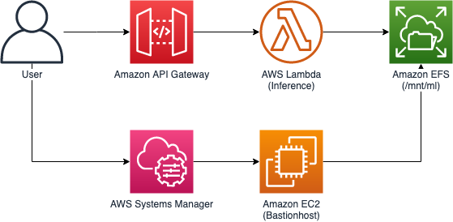

# PyTorch Inference on Lambda + EFS

This repository is for inferencing PyTorch/Tensorflow model on Lambda and EFS

Running this repository may cost you to provision AWS resources



# Prerequisites

- awscli
- AWS Account and Locally configured AWS credential

# Installation

## CDK

```bash
$ cd infra
$ npm i
```

Install cdk in global context and run bootstrap if you did not initailize cdk yet.
```bash
$ npm i -g cdk@1.76.0
$ cdk bootstrap
$ cdk deploy "*" --require-approval never
```

## EFS
Connect to Bastionhost

```bash
export BASTION_ID=$(aws cloudformation describe-stacks --stack-name MLInferenceInfraStack --query "Stacks[0].Outputs[?ExportName=='BastionHostId'].OutputValue" --output text)
$ echo $BASTION_ID
i-01afaf5d4aafa5a9f

$ aws ssm start-session --target $BASTION_ID
sh-4.2$
```

Get EFS Filesystem Id and EFS AccessPoint Id

```bash
# Filesystem Id
$ aws cloudformation describe-stacks --stack-name MLInferenceInfraStack --query "Stacks[0].Outputs[?ExportName=='FilesystemId'].OutputValue" --output text
fs-4610f726

# EFS AccessPoint Id
$ aws cloudformation describe-stacks --stack-name MLInferenceInfraStack --query "Stacks[0].Outputs[?ExportName=='AccessPointId'].OutputValue" --output text
fsap-00770e5ffaf2cd41c
```

Mount EFS access point to Bastionhost

```bash
sh-4.2$ sudo yum -y install amazon-efs-utils
sh-4.2$ sudo mkdir /mnt/ml
sh-4.2$ sudo mount -t efs -o tls,iam,accesspoint=fsap-00770e5ffaf2cd41c fs-4610f726: /mnt/ml
```

### DETR (based on PyTorch)

Build [**requirements**](deps/detr.txt) for [**DETR**](https://github.com/facebookresearch/detr) Model

```bash
sh-4.2$ cd
sh-4.2$ cat >> detr.txt
cython
submitit
torch>=1.5.0
torchvision>=0.6.0
scipy
^D
```

Install dependencies to run PyTorch on lambda

```bash
sh-4.2$ sudo yum install python3 -y
sh-4.2$ pip3 install -t /mnt/ml/detr/lib -r detr.txt

# Create directory for DETR hub cache
sh-4.2$ mkdir -p /mnt/ml/detr/model/hub

# give permission to write on model for caching
sh-4.2$ sudo chmod -R o+w /mnt/ml/detr/model
```

### YOLOv4 (Based on TF)
Build [**requirements**](deps/yolo.txt) for [**YOLOv4**](https://github.com/theAIGuysCode/tensorflow-yolov4-tflite/) Model
```bash
sh-4.2$ cd
sh-4.2$ cat >> yolo.txt
Cython
torch
torchvision
scipy
numpy
Pillow
PyYAML
tqdm
matplotlib==3.2.2
opencv-python>=4.2.0
tensorboard==2.2
^D
```

Install dependencies to run PyTorch on lambda

```bash
sh-4.2$ sudo yum install python3 -y
sh-4.2$ pip3 install -t /mnt/ml/yolo/lib -r yolo.txt

# Create directory for YOLO hub cache
sh-4.2$ mkdir -p /mnt/ml/yolo/model/hub

```

#### Generate Model for YOLOv4

> Below is tricky part, you should convert weight to tf checkout protobuf file for YOLO

[**For details**](https://github.com/theAIGuysCode/tensorflow-yolov4-tflite/)

Install dependencies

```bash
sh-4.2$ sudo yum groupinstall "Development Tools" -y
sh-4.2$ sudo yum install libXext libSM libXrender -y
```

Clone repository to convert weights to model

```bash
sh-4.2$ git clone https://github.com/theAIGuysCode/tensorflow-yolov4-tflite/
sh-4.2$ cd tensorflow-yolov4-tflite
sh-4.2$ pip install -r requirements.txt
```

Download [**weights**](https://drive.google.com/open?id=1cewMfusmPjYWbrnuJRuKhPMwRe_b9PaT) and copy it to Bastionhost (using S3 or something)

```bash
sh-4.2$ aws configure
AWS Access Key ID [****************MT6L]: 
AWS Secret Access Key [****************yX2F]: 
Default region name [ap-northeast-2]: 
Default output format [json]:
sh-4.2$ aws s3 cp s3://yolov4-dongkyl/yolov4.weights ./data/yolov4.weights
```

Run *save_model.py*. It will take 2~4 minutes to complete, grab some coffee.

```bash
sh-4.2$ python3 save_model.py --weights ./data/yolov4.weights --output ./checkpoints/yolov4-416 --input_size 416 --model yolov4
...
INFO:tensorflow:Assets written to: ./checkpoints/yolov4-416/assets
I1210 07:17:00.547124 140626054760256 builder_impl.py:775] Assets written to: ./checkpoints/yolov4-416/assets

sh-4.2$ ls checkpoints/
yolov4-416
```

Copy checkpoint file to EFS mounting point, `/mnt/ml/yolo/model`

```bash
sh-4.2$ cp -R checkpoints/yolov4-416/ /mnt/ml/yolo/model 
sh-4.2$ ls /mnt/ml/yolo/model
yolov4-416
```

# Inference

> First invocation will take over **60s** which is timeout limit for API Gateway

## DETR

Invoke `/inference/detr` endpoint to detect objects

```bash
$ export URL=$(aws cloudformation describe-stacks --stack-name MLInferenceInfraStack --query "Stacks[0].Outputs[?ExportName=='HttpApiUrl'].OutputValue" --output text)
$ http post $URL/inference/detr url==http://images.cocodataset.org/val2017/000000039769.jpg

HTTP/1.1 200 OK
Apigw-Requestid: XRdzDialIE0EQaw=
Connection: keep-alive
Content-Length: 35
Content-Type: application/json
Date: Wed, 09 Dec 2020 07:02:18 GMT

{
    "probas": [...],
    "bbox": [...]
}
```

Open [**DetrInference.ipynb**](DetrInference.ipynb) on JupyterLab, and run cells to check out visualized result

## Yolov4

Invoke `/inference/yolo` endpoint to detect objects

```bash
$ export URL=$(aws cloudformation describe-stacks --stack-name MLInferenceInfraStack --query "Stacks[0].Outputs[?ExportName=='HttpApiUrl'].OutputValue" --output text)
$ http post $URL/inference/yolo url==http://images.cocodataset.org/val2017/000000039769.jpg

HTTP/1.1 200 OK
Apigw-Requestid: XRdzDialIE0EQaw=
Connection: keep-alive
Content-Length: 35
Content-Type: application/json
Date: Wed, 09 Dec 2020 07:02:18 GMT

{
    "scores": [...],
    "boxes": [...]
    "classes": [...]
}
```

Open [**YoloInference.ipynb**](YoloInference.ipynb) on JupyterLab, and run cells to check out visualized result

# Cleanup

Destroy deployed resources on this project

```bash
$ cdk destroy "*"
```
